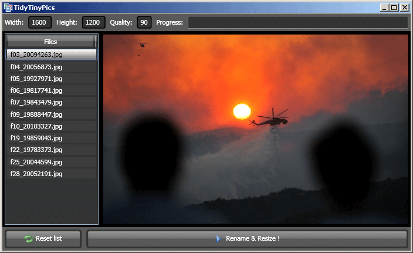

# Tidy Tiny Pics
This imaging tool resizes pictures / images / photos and renames the files consistently (without losing any information, like EXIF). It works using independent files, directories and sub-directories.

This project was made using C# and WPF, in 2008. Below, there is an old screenshot, note that at this time I was not taking photos otherwise I would have used one of my own :)

## Terrible Screenshot

